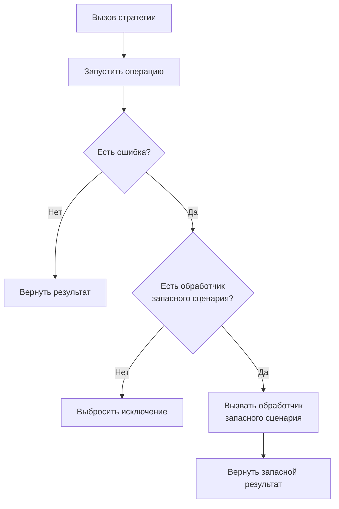

# СтратегияЗапасногоСценария

**Английское название:** `Fallback`.

## Синтаксис:

```bsl
Новый СтратегияЗапасногоСценария(<Обработчик>, <ДополнительныеПараметры>)
```

**Параметры:**

| Имя | Тип | Значение по умолчанию | Описание |
| -- | -- | -- | -- |
| Обработчик | Действие, Строка, Неопределено | `Неопределено` | Обработчик, который будет вызван при ошибке основной операции. Строка трактуется как лямбда-выражение. Обработчик должен возвращать результат запасного сценария |
| ДополнительныеПараметры | Массив, ФиксированныйМассив, Произвольный, Неопределено | `Неопределено` | Дополнительные параметры, которые будут переданы обработчику после контекста ошибки |


## Методы

[Применить](#применить) </br>
[УстановитьОбработчик](#установитьобработчик)


## Применить

**Синтаксис:**

```bsl
Применить(<Операция>, <Параметры>, <СигналПрерыванияОперации>)
```

**Параметры:**

| Имя | Тип | Значение по умолчанию | Описание |
| -- | -- | -- | -- |
| Операция | Действие, ШагПайплайнаОтказоустойчивости, Строка |  | Выполняемая операция, вложенный шаг пайплайна или лямбда-выражение операции |
| Параметры | Массив, ФиксированныйМассив, Произвольный, Неопределено | `Неопределено` | Параметры основной операции |
| СигналПрерыванияОперации | СигналПрерыванияОперации, Неопределено | `Неопределено` | Сигнал кооперативного прерывания операции |

**Возвращаемое значение:**

Тип: Произвольный.

**Описание:**

Выполняет основную операцию и, в случае ошибки, возвращает результат запасного сценария. Обработчик получает [КонтекстОшибкиЗапасногоСценария](КонтекстОшибкиЗапасногоСценария.md).

Если прерывание уже запрошено до запуска основной операции, стратегия выбрасывает исключение прерывания и не выполняет запасной сценарий.

**Диаграмма выполнения:**




## УстановитьОбработчик

**Синтаксис:**

```bsl
УстановитьОбработчик(<Обработчик>, <ДополнительныеПараметры>)
```

**Параметры:**

| Имя | Тип | Описание |
| -- | -- | -- |
| Обработчик | Действие, Строка | Обработчик, который будет вызван при ошибке основной операции. Строка трактуется как лямбда-выражение. Обработчик должен возвращать результат запасного сценария |
| ДополнительныеПараметры | Массив, ФиксированныйМассив, Произвольный, Неопределено | Дополнительные параметры, которые будут переданы обработчику после контекста ошибки |

**Возвращаемое значение:**

Тип: СтратегияЗапасногоСценария.

**Описание:**

Устанавливает обработчик запасного сценария. Обработчик получает [КонтекстОшибкиЗапасногоСценария](КонтекстОшибкиЗапасногоСценария.md) и должен возвращать значение, которое станет результатом запасного сценария. Если заданы дополнительные параметры, они передаются после контекста ошибки. Подробности о лямбда-выражениях см. в [руководстве](ЛямбдаВыражения.md).
