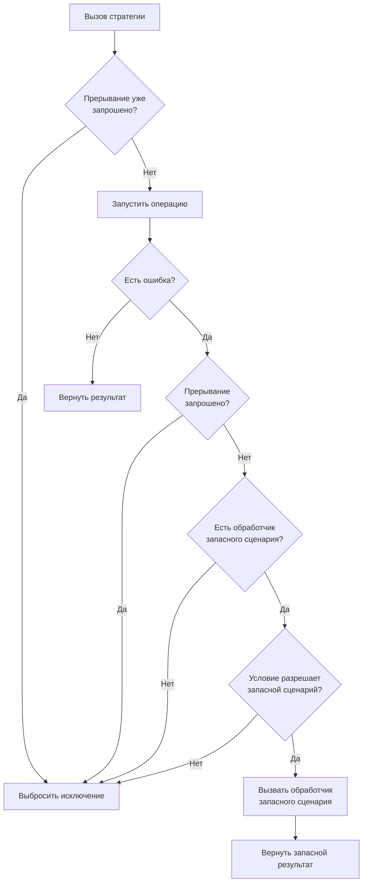

# СтратегияЗапасногоСценария

**Английское название:** `Fallback`.

## Синтаксис:

```bsl
Новый СтратегияЗапасногоСценария(<Обработчик>, <ДополнительныеПараметры>)
```

**Параметры:**

| Имя | Тип | Значение по умолчанию | Описание |
| -- | -- | -- | -- |
| Обработчик | Действие, Строка, Неопределено | `Неопределено` | Обработчик, который будет вызван при ошибке основной операции. Строка трактуется как лямбда-выражение. Обработчик должен возвращать результат запасного сценария |
| ДополнительныеПараметры | Массив, ФиксированныйМассив, Произвольный, Неопределено | `Неопределено` | Дополнительные параметры, которые будут переданы обработчику после контекста ошибки |


## Как работает

Стратегия выполняет основную операцию. Если операция завершилась ошибкой, стратегия может вернуть результат запасного сценария вместо исходного исключения. Обработчик запасного сценария получает [КонтекстОшибкиЗапасногоСценария](КонтекстОшибкиЗапасногоСценария.md).

Если задано условие запасного сценария, стратегия сначала вызывает его с тем же контекстом ошибки. `Истина` разрешает выполнить запасной сценарий, `Ложь` пробрасывает исходное исключение без вызова обработчика.

Если прерывание уже запрошено до запуска основной операции, стратегия выбрасывает исключение прерывания и не выполняет запасной сценарий. Если во время выполнения основной операции было запрошено прерывание и операция завершилась исключением, стратегия пробрасывает это исключение без выполнения запасного сценария.

**Диаграмма выполнения:**


```mermaid
flowchart TD
    A[Вызов стратегии] --> B{Прерывание уже<br/>запрошено?}
    B -- Да --> C[Выбросить исключение]
    B -- Нет --> D[Запустить операцию]
    D --> E{Есть ошибка?}
    E -- Нет --> F[Вернуть результат]
    E -- Да --> G{Прерывание<br/>запрошено?}
    G -- Да --> C
    G -- Нет --> H{Есть обработчик<br/>запасного сценария?}
    H -- Нет --> C
    H -- Да --> I{Условие разрешает<br/>запасной сценарий?}
    I -- Нет --> C
    I -- Да --> J[Вызвать обработчик<br/>запасного сценария]
    J --> K[Вернуть запасной результат]
```


## Методы

[Применить](#применить) </br>
[УстановитьОбработчик](#установитьобработчик) </br>
[УстановитьУсловиеЗапасногоСценария](#установитьусловиезапасногосценария)


## Применить

**Синтаксис:**

```bsl
Применить(<Операция>, <Параметры>, <СигналПрерыванияОперации>)
```

**Параметры:**

| Имя | Тип | Значение по умолчанию | Описание |
| -- | -- | -- | -- |
| Операция | Действие, ШагПайплайнаОтказоустойчивости, Строка |  | Выполняемая операция, вложенный шаг пайплайна или лямбда-выражение операции |
| Параметры | Массив, ФиксированныйМассив, Произвольный, Неопределено | `Неопределено` | Параметры основной операции |
| СигналПрерыванияОперации | СигналПрерыванияОперации, Неопределено | `Неопределено` | Сигнал кооперативного прерывания операции |

**Возвращаемое значение:**

Тип: Произвольный.

**Описание:**

Выполняет основную операцию с учетом настроек запасного сценария.


## УстановитьОбработчик

**Синтаксис:**

```bsl
УстановитьОбработчик(<Обработчик>, <ДополнительныеПараметры>)
```

**Параметры:**

| Имя | Тип | Описание |
| -- | -- | -- |
| Обработчик | Действие, Строка | Обработчик, который будет вызван при ошибке основной операции. Строка трактуется как лямбда-выражение. Обработчик должен возвращать результат запасного сценария |
| ДополнительныеПараметры | Массив, ФиксированныйМассив, Произвольный, Неопределено | Дополнительные параметры, которые будут переданы обработчику после контекста ошибки |

**Возвращаемое значение:**

Тип: СтратегияЗапасногоСценария.

**Описание:**

Устанавливает обработчик запасного сценария. Обработчик получает [КонтекстОшибкиЗапасногоСценария](КонтекстОшибкиЗапасногоСценария.md) и должен возвращать значение, которое станет результатом запасного сценария. Если заданы дополнительные параметры, они передаются после контекста ошибки. Подробности о лямбда-выражениях см. в [руководстве](ЛямбдаВыражения.md).


## УстановитьУсловиеЗапасногоСценария

**Синтаксис:**

```bsl
УстановитьУсловиеЗапасногоСценария(<Условие>, <ДополнительныеПараметры>)
```

**Параметры:**

| Имя | Тип | Описание |
| -- | -- | -- |
| Условие | Действие, Строка | Условие выполнения запасного сценария. Строка трактуется как лямбда-выражение. Получает [КонтекстОшибкиЗапасногоСценария](КонтекстОшибкиЗапасногоСценария.md) и должно возвращать `Булево` |
| ДополнительныеПараметры | Массив, ФиксированныйМассив, Произвольный, Неопределено | Дополнительные параметры, которые будут переданы условию после контекста ошибки |

**Возвращаемое значение:**

Тип: СтратегияЗапасногоСценария.

**Описание:**

Устанавливает условие, которое решает, нужно ли выполнять запасной сценарий после ошибки основной операции. Если условие возвращает `Истина`, стратегия вызывает обработчик запасного сценария. Если условие возвращает `Ложь`, стратегия пробрасывает исходное исключение и не вызывает обработчик.

Если условие не задано, стратегия выполняет запасной сценарий при любой ошибке основной операции, кроме случаев запрошенного прерывания.
