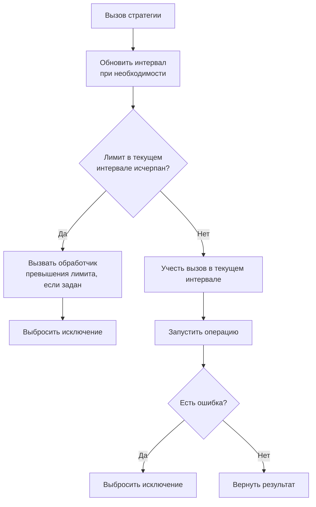

# СтратегияОграниченияВызовов

**Английское название:** `Rate Limiter`.

## Синтаксис:

```bsl
Новый СтратегияОграниченияВызовов(<ЛимитВызовов>, <ИнтервалЛимита>)
```

**Параметры:**

| Имя | Тип | Значение по умолчанию | Описание |
| -- | -- | -- | -- |
| ЛимитВызовов | Число | `10` | Максимально допустимое количество вызовов за интервал |
| ИнтервалЛимита | Число | `1000` | Длительность интервала лимита в миллисекундах |


## Методы

[Применить](#применить) </br>
[УстановитьЛимитВызовов](#установитьлимитвызовов) </br>
[УстановитьИнтервалЛимита](#установитьинтерваллимита) </br>
[УстановитьОбработчикПревышенияЛимита](#установитьобработчикпревышениялимита) </br>
[ЛимитВызовов](#лимитвызовов) </br>
[ИнтервалЛимита](#интерваллимита) </br>
[КоличествоВызововЗаИнтервал](#количествовызововзаинтервал) </br>
[Сбросить](#сбросить)


## Применить

**Синтаксис:**

```bsl
Применить(<Операция>, <Параметры>, <СигналПрерыванияОперации>)
```

**Параметры:**

| Имя | Тип | Значение по умолчанию | Описание |
| -- | -- | -- | -- |
| Операция | Действие, ШагПайплайнаОтказоустойчивости, Строка |  | Выполняемая операция, вложенный шаг пайплайна или лямбда-выражение операции |
| Параметры | Массив, ФиксированныйМассив, Произвольный, Неопределено | `Неопределено` | Параметры операции |
| СигналПрерыванияОперации | СигналПрерыванияОперации, Неопределено | `Неопределено` | Сигнал кооперативного прерывания операции |

**Возвращаемое значение:**

Тип: Произвольный.

**Описание:**

Выполняет операцию, если лимит вызовов в текущем интервале еще не исчерпан.

Если прерывание уже запрошено до начала выполнения, стратегия выбрасывает исключение прерывания и не расходует лимит текущего интервала.

**Диаграмма выполнения:**




## УстановитьЛимитВызовов

**Синтаксис:**

```bsl
УстановитьЛимитВызовов(<ЛимитВызовов>)
```

**Параметры:**

| Имя | Тип | Описание |
| -- | -- | -- |
| ЛимитВызовов | Число | Максимально допустимое количество вызовов за интервал |

**Возвращаемое значение:**

Тип: СтратегияОграниченияВызовов.

**Описание:**

Устанавливает лимит вызовов за интервал.


## УстановитьИнтервалЛимита

**Синтаксис:**

```bsl
УстановитьИнтервалЛимита(<ИнтервалЛимита>)
```

**Параметры:**

| Имя | Тип | Описание |
| -- | -- | -- |
| ИнтервалЛимита | Число | Длительность интервала лимита в миллисекундах |

**Возвращаемое значение:**

Тип: СтратегияОграниченияВызовов.

**Описание:**

Устанавливает интервал лимита.


## УстановитьОбработчикПревышенияЛимита

**Синтаксис:**

```bsl
УстановитьОбработчикПревышенияЛимита(<Обработчик>, <ДополнительныеПараметры>)
```

**Параметры:**

| Имя | Тип | Описание |
| -- | -- | -- |
| Обработчик | Действие, Строка | Обработчик, вызываемый при превышении лимита. Строка трактуется как лямбда-выражение. Получает [КонтекстПревышенияЛимита](КонтекстПревышенияЛимита.md). Возвращаемое значение не используется |
| ДополнительныеПараметры | Массив, ФиксированныйМассив, Произвольный, Неопределено | Дополнительные параметры, которые будут переданы обработчику после контекста превышения лимита |

**Возвращаемое значение:**

Тип: СтратегияОграниченияВызовов.

**Описание:**

Устанавливает обработчик превышения лимита вызовов. Если заданы дополнительные параметры, они передаются после контекста превышения лимита. Подробности о лямбда-выражениях см. в [руководстве](ЛямбдаВыражения.md).


## ЛимитВызовов

**Синтаксис:**

```bsl
ЛимитВызовов()
```

**Возвращаемое значение:**

Тип: Число.

**Описание:**

Возвращает текущий лимит вызовов.


## ИнтервалЛимита

**Синтаксис:**

```bsl
ИнтервалЛимита()
```

**Возвращаемое значение:**

Тип: Число.

**Описание:**

Возвращает текущий интервал лимита в миллисекундах.


## КоличествоВызововЗаИнтервал

**Синтаксис:**

```bsl
КоличествоВызововЗаИнтервал()
```

**Возвращаемое значение:**

Тип: Число.

**Описание:**

Возвращает количество вызовов, уже выполненных в текущем интервале.


## Сбросить

**Синтаксис:**

```bsl
Сбросить()
```

**Возвращаемое значение:**

Тип: СтратегияОграниченияВызовов.

**Описание:**

Сбрасывает текущее состояние интервала лимита.
