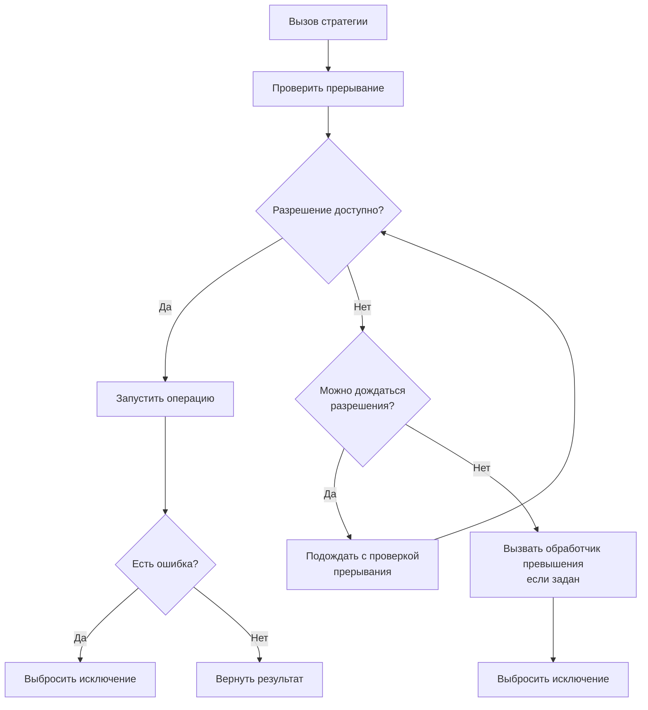

# СтратегияОграниченияВызовов

**Английское название:** `Rate Limiter`.

## Синтаксис:

```bsl
Новый СтратегияОграниченияВызовов(<ЛимитВызовов>, <ИнтервалЛимита>)
```

**Параметры:**

| Имя | Тип | Значение по умолчанию | Описание |
| -- | -- | -- | -- |
| ЛимитВызовов | Число | `10` | Максимально допустимое количество вызовов за интервал |
| ИнтервалЛимита | Число | `1000` | Длительность интервала лимита в миллисекундах |


## Как работает

Стратегия выполняет операцию, если может получить разрешение на вызов.

По умолчанию используется фиксированное окно: стратегия допускает не больше `ЛимитВызовов` за `ИнтервалЛимита`. Если лимит исчерпан и `МаксимальноеОжиданиеРазрешения` равно `0`, вызов сразу отклоняется. Если ожидание включено и ближайшее разрешение укладывается в заданный лимит ожидания, стратегия кооперативно ждет освобождения разрешения и затем выполняет операцию.

В режиме `ТипыОграниченияВызовов.РавномерноеРаспределение` разрешения распределяются равномерно по интервалу. Например, лимит `2` за `120` мс дает одно разрешение примерно каждые `60` мс.

Если прерывание уже запрошено до начала выполнения, стратегия выбрасывает исключение прерывания и не расходует лимит текущего интервала. Если прерывание запрошено во время ожидания разрешения, стратегия завершает ожидание, выбрасывает исключение прерывания и не запускает пользовательскую операцию.

**Диаграмма выполнения:**


```mermaid
flowchart TD
    A[Вызов стратегии] --> B[Проверить прерывание]
    B --> C{Разрешение доступно?}
    C -- Да --> H[Запустить операцию]
    C -- Нет --> D{Можно дождаться<br/>разрешения?}
    D -- Да --> F[Подождать с проверкой<br/>прерывания]
    F --> C
    D -- Нет --> E[Вызвать обработчик превышения<br/>если задан]
    E --> G[Выбросить исключение]
    H --> I{Есть ошибка?}
    I -- Да --> J[Выбросить исключение]
    I -- Нет --> K[Вернуть результат]
```


## Методы

[Применить](#применить) </br>
[УстановитьЛимитВызовов](#установитьлимитвызовов) </br>
[УстановитьИнтервалЛимита](#установитьинтерваллимита) </br>
[УстановитьМаксимальноеОжиданиеРазрешения](#установитьмаксимальноеожиданиеразрешения) </br>
[УстановитьТипОграничения](#установитьтипограничения) </br>
[УстановитьОбработчикПревышенияЛимита](#установитьобработчикпревышениялимита) </br>
[ЛимитВызовов](#лимитвызовов) </br>
[ИнтервалЛимита](#интерваллимита) </br>
[МаксимальноеОжиданиеРазрешения](#максимальноеожиданиеразрешения) </br>
[ТипОграничения](#типограничения) </br>
[КоличествоВызововЗаИнтервал](#количествовызововзаинтервал) </br>
[Сбросить](#сбросить)


## Применить

**Синтаксис:**

```bsl
Применить(<Операция>, <Параметры>, <СигналПрерыванияОперации>)
```

**Параметры:**

| Имя | Тип | Значение по умолчанию | Описание |
| -- | -- | -- | -- |
| Операция | Действие, ШагПайплайнаОтказоустойчивости, Строка |  | Выполняемая операция, вложенный шаг пайплайна или лямбда-выражение операции |
| Параметры | Массив, ФиксированныйМассив, Произвольный, Неопределено | `Неопределено` | Параметры операции |
| СигналПрерыванияОперации | СигналПрерыванияОперации, Неопределено | `Неопределено` | Сигнал кооперативного прерывания операции |

**Возвращаемое значение:**

Тип: Произвольный.

**Описание:**

Выполняет операцию с учетом настроенного ограничения вызовов.


## УстановитьЛимитВызовов

**Синтаксис:**

```bsl
УстановитьЛимитВызовов(<ЛимитВызовов>)
```

**Параметры:**

| Имя | Тип | Описание |
| -- | -- | -- |
| ЛимитВызовов | Число | Максимально допустимое количество вызовов за интервал |

**Возвращаемое значение:**

Тип: СтратегияОграниченияВызовов.

**Описание:**

Устанавливает лимит вызовов за интервал. В режиме равномерного распределения сбрасывает текущее расписание разрешений, начало текущего интервала и счетчик вызовов за интервал.


## УстановитьИнтервалЛимита

**Синтаксис:**

```bsl
УстановитьИнтервалЛимита(<ИнтервалЛимита>)
```

**Параметры:**

| Имя | Тип | Описание |
| -- | -- | -- |
| ИнтервалЛимита | Число | Длительность интервала лимита в миллисекундах |

**Возвращаемое значение:**

Тип: СтратегияОграниченияВызовов.

**Описание:**

Устанавливает интервал лимита. В режиме равномерного распределения сбрасывает текущее расписание разрешений, начало текущего интервала и счетчик вызовов за интервал.


## УстановитьМаксимальноеОжиданиеРазрешения

**Синтаксис:**

```bsl
УстановитьМаксимальноеОжиданиеРазрешения(<МаксимальноеОжиданиеРазрешения>)
```

**Параметры:**

| Имя | Тип | Значение по умолчанию | Описание |
| -- | -- | -- | -- |
| МаксимальноеОжиданиеРазрешения | Число | `0` | Максимальное время ожидания разрешения в миллисекундах. `0` означает отказ без ожидания |

**Возвращаемое значение:**

Тип: СтратегияОграниченияВызовов.

**Описание:**

Включает ожидание разрешения вместо немедленного отказа при превышении лимита. Ограничение применяется к общему ожиданию одного вызова `Применить`.


## УстановитьТипОграничения

**Синтаксис:**

```bsl
УстановитьТипОграничения(<ТипОграничения>)
```

**Параметры:**

| Имя | Тип | Значение по умолчанию | Описание |
| -- | -- | -- | -- |
| ТипОграничения | Строка | `ТипыОграниченияВызовов.ФиксированноеОкно` | см. [ТипыОграниченияВызовов](ТипыОграниченияВызовов.md) |

**Возвращаемое значение:**

Тип: СтратегияОграниченияВызовов.

**Описание:**

Устанавливает алгоритм выдачи разрешений. При смене типа сбрасывает счетчик текущего интервала и расписание равномерного распределения.


## УстановитьОбработчикПревышенияЛимита

**Синтаксис:**

```bsl
УстановитьОбработчикПревышенияЛимита(<Обработчик>, <ДополнительныеПараметры>)
```

**Параметры:**

| Имя | Тип | Описание |
| -- | -- | -- |
| Обработчик | Действие, Строка | Обработчик, вызываемый при превышении лимита. Строка трактуется как лямбда-выражение. Получает [КонтекстПревышенияЛимита](КонтекстПревышенияЛимита.md). Возвращаемое значение не используется |
| ДополнительныеПараметры | Массив, ФиксированныйМассив, Произвольный, Неопределено | Дополнительные параметры, которые будут переданы обработчику после контекста превышения лимита |

**Возвращаемое значение:**

Тип: СтратегияОграниченияВызовов.

**Описание:**

Устанавливает обработчик превышения лимита вызовов. Если заданы дополнительные параметры, они передаются после контекста превышения лимита. Подробности о лямбда-выражениях см. в [руководстве](ЛямбдаВыражения.md).


## ЛимитВызовов

**Синтаксис:**

```bsl
ЛимитВызовов()
```

**Возвращаемое значение:**

Тип: Число.

**Описание:**

Возвращает текущий лимит вызовов.


## ИнтервалЛимита

**Синтаксис:**

```bsl
ИнтервалЛимита()
```

**Возвращаемое значение:**

Тип: Число.

**Описание:**

Возвращает текущий интервал лимита в миллисекундах.


## МаксимальноеОжиданиеРазрешения

**Синтаксис:**

```bsl
МаксимальноеОжиданиеРазрешения()
```

**Возвращаемое значение:**

Тип: Число.

**Описание:**

Возвращает максимальное время ожидания разрешения в миллисекундах. Значение `0` означает отказ без ожидания.


## ТипОграничения

**Синтаксис:**

```bsl
ТипОграничения()
```

**Возвращаемое значение:**

Тип: Строка.

**Описание:**

Возвращает текущий тип ограничения вызовов. Возможные значения описаны в [ТипыОграниченияВызовов](ТипыОграниченияВызовов.md).


## КоличествоВызововЗаИнтервал

**Синтаксис:**

```bsl
КоличествоВызововЗаИнтервал()
```

**Возвращаемое значение:**

Тип: Число.

**Описание:**

Возвращает количество вызовов, уже выполненных в текущем интервале.


## Сбросить

**Синтаксис:**

```bsl
Сбросить()
```

**Возвращаемое значение:**

Тип: СтратегияОграниченияВызовов.

**Описание:**

Сбрасывает текущее состояние интервала лимита.
