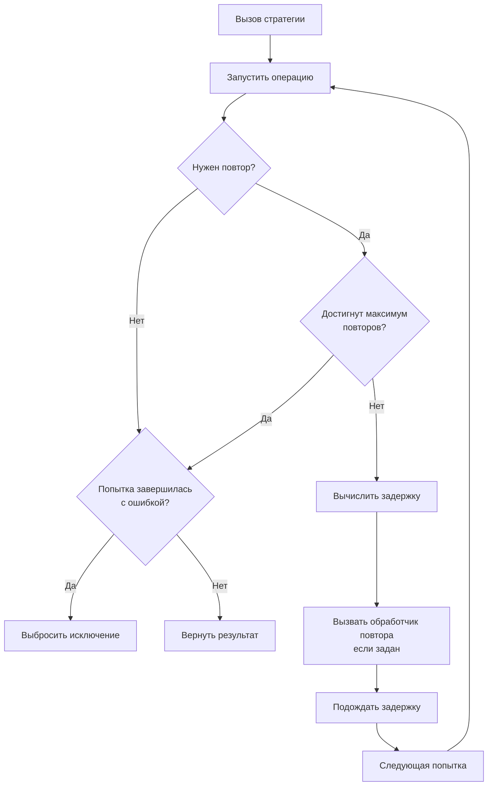

# СтратегияПовтора

**Английское название:** `Retry`.

## Синтаксис:

```bsl
Новый СтратегияПовтора(<КоличествоПовторов>, <Задержка>)
```

**Параметры:**

| Имя | Тип | Значение по умолчанию | Описание |
| -- | -- | -- | -- |
| КоличествоПовторов | Число | `3` | Количество повторных попыток без учета исходного вызова |
| Задержка | Число | `2000` | Базовая задержка в миллисекундах |


## Методы

[Применить](#применить) </br>
[УстановитьМаксимумПовторов](#установитьмаксимумповторов) </br>
[УстановитьЗадержку](#установитьзадержку) </br>
[УстановитьТипЗадержки](#установитьтипзадержки) </br>
[ИспользоватьРазбросЗадержки](#использоватьразбросзадержки) </br>
[УстановитьМаксимальнуюЗадержку](#установитьмаксимальнуюзадержку) </br>
[УстановитьУсловиеПовтора](#установитьусловиеповтора) </br>
[УстановитьВычислениеЗадержки](#установитьвычислениезадержки) </br>
[УстановитьОбработчикПовтора](#установитьобработчикповтора) </br>
[КоличествоПовторов](#количествоповторов) </br>
[ТипЗадержки](#типзадержки) </br>
[Задержка](#задержка) </br>
[МаксимальнаяЗадержка](#максимальнаязадержка) </br>
[ИспользуетсяРазбросЗадержки](#используетсяразбросзадержки)


## Применить

**Синтаксис:**

```bsl
Применить(<Операция>, <Параметры>, <СигналПрерыванияОперации>)
```

**Параметры:**

| Имя | Тип | Значение по умолчанию | Описание |
| -- | -- | -- | -- |
| Операция | Действие, ШагПайплайнаОтказоустойчивости, Строка |  | Выполняемая операция, вложенный шаг пайплайна или лямбда-выражение операции |
| Параметры | Массив, ФиксированныйМассив, Произвольный, Неопределено | `Неопределено` | Параметры операции |
| СигналПрерыванияОперации | СигналПрерыванияОперации, Неопределено | `Неопределено` | Сигнал кооперативного прерывания операции |

**Возвращаемое значение:**

Тип: Произвольный.

**Описание:**

Выполняет операцию с учетом настроек повторов.

Если во время выполнения уже запрошено прерывание, стратегия не запускает следующую попытку. Уже начатая задержка между попытками не прерывается: после ее завершения следующая попытка просто не будет запущена.

**Диаграмма выполнения:**




## УстановитьМаксимумПовторов

**Синтаксис:**

```bsl
УстановитьМаксимумПовторов(<МаксимумПовторов>)
```

**Параметры:**

| Имя | Тип | Описание |
| -- | -- | -- |
| МаксимумПовторов | Число | Количество повторных попыток без учета исходного вызова |

**Возвращаемое значение:**

Тип: СтратегияПовтора.

**Описание:**

Устанавливает максимальное количество повторов после первой попытки.


## УстановитьЗадержку

**Синтаксис:**

```bsl
УстановитьЗадержку(<Задержка>)
```

**Параметры:**

| Имя | Тип | Описание |
| -- | -- | -- |
| Задержка | Число | Базовая задержка в миллисекундах |

**Возвращаемое значение:**

Тип: СтратегияПовтора.

**Описание:**

Устанавливает базовую задержку между повторами.


## УстановитьТипЗадержки

**Синтаксис:**

```bsl
УстановитьТипЗадержки(<ТипЗадержки>)
```

**Параметры:**

| Имя | Тип | Описание |
| -- | -- | -- |
| ТипЗадержки | Строка | см. [ТипыРасчетаЗадержки](ТипыРасчетаЗадержки.md) |

**Возвращаемое значение:**

Тип: СтратегияПовтора.

**Описание:**

Устанавливает тип расчета задержки между попытками.


## ИспользоватьРазбросЗадержки

**Синтаксис:**

```bsl
ИспользоватьРазбросЗадержки(<Использовать>)
```

**Параметры:**

| Имя | Тип | Значение по умолчанию | Описание |
| -- | -- | -- | -- |
| Использовать | Булево | `Истина` | Включает или выключает разброс задержки |

**Возвращаемое значение:**

Тип: СтратегияПовтора.

**Описание:**

Включает или выключает использование случайного разброса задержки.


## УстановитьМаксимальнуюЗадержку

**Синтаксис:**

```bsl
УстановитьМаксимальнуюЗадержку(<МаксимальнаяЗадержка>)
```

**Параметры:**

| Имя | Тип | Значение по умолчанию | Описание |
| -- | -- | -- | -- |
| МаксимальнаяЗадержка | Число | `0` | Максимально допустимая задержка в миллисекундах. `0` отключает ограничение |

**Возвращаемое значение:**

Тип: СтратегияПовтора.

**Описание:**

Устанавливает верхнюю границу задержки между повторами.


## УстановитьУсловиеПовтора

**Синтаксис:**

```bsl
УстановитьУсловиеПовтора(<Обработчик>, <ДополнительныеПараметры>)
```

**Параметры:**

| Имя | Тип | Описание |
| -- | -- | -- |
| Обработчик | Действие, Строка | Пользовательское условие повтора. Строка трактуется как лямбда-выражение. Получает [КонтекстПопыткиПовтора](КонтекстПопыткиПовтора.md) и должно возвращать `Булево` |
| ДополнительныеПараметры | Массив, ФиксированныйМассив, Произвольный, Неопределено | Дополнительные параметры, которые будут переданы обработчику после контекста повтора |

**Возвращаемое значение:**

Тип: СтратегияПовтора.

**Описание:**

Устанавливает условие, которое определяет необходимость следующей попытки. Обработчик должен возвращать `Истина`, если операцию нужно повторить, и `Ложь` в противном случае. Если заданы дополнительные параметры, они передаются после контекста повтора. Подробности о лямбда-выражениях см. в [руководстве](ЛямбдаВыражения.md).


## УстановитьВычислениеЗадержки

**Синтаксис:**

```bsl
УстановитьВычислениеЗадержки(<Обработчик>, <ДополнительныеПараметры>)
```

**Параметры:**

| Имя | Тип | Описание |
| -- | -- | -- |
| Обработчик | Действие, Строка | Пользовательское вычисление задержки. Строка трактуется как лямбда-выражение. Получает [КонтекстПопыткиПовтора](КонтекстПопыткиПовтора.md) и должно возвращать `Число` |
| ДополнительныеПараметры | Массив, ФиксированныйМассив, Произвольный, Неопределено | Дополнительные параметры, которые будут переданы обработчику после контекста повтора |

**Возвращаемое значение:**

Тип: СтратегияПовтора.

**Описание:**

Устанавливает пользовательский расчет задержки перед повтором. Обработчик должен возвращать задержку в миллисекундах или `Неопределено`, чтобы использовать рассчитанное библиотекой значение. Если заданы дополнительные параметры, они передаются после контекста повтора. Подробности о лямбда-выражениях см. в [руководстве](ЛямбдаВыражения.md).


## УстановитьОбработчикПовтора

**Синтаксис:**

```bsl
УстановитьОбработчикПовтора(<Обработчик>, <ДополнительныеПараметры>)
```

**Параметры:**

| Имя | Тип | Описание |
| -- | -- | -- |
| Обработчик | Действие, Строка | Обработчик, который вызывается перед повтором. Строка трактуется как лямбда-выражение. Получает [КонтекстПопыткиПовтора](КонтекстПопыткиПовтора.md). Возвращаемое значение не используется |
| ДополнительныеПараметры | Массив, ФиксированныйМассив, Произвольный, Неопределено | Дополнительные параметры, которые будут переданы обработчику после контекста повтора |

**Возвращаемое значение:**

Тип: СтратегияПовтора.

**Описание:**

Устанавливает обработчик перед следующей попыткой. Если заданы дополнительные параметры, они передаются после контекста повтора. Подробности о лямбда-выражениях см. в [руководстве](ЛямбдаВыражения.md).


## КоличествоПовторов

**Синтаксис:**

```bsl
КоличествоПовторов()
```

**Возвращаемое значение:**

Тип: Число.

**Описание:**

Получает установленное количество повторов.


## ТипЗадержки

**Синтаксис:**

```bsl
ТипЗадержки()
```

**Возвращаемое значение:**

Тип: Строка.

**Описание:**

Получает текущий тип расчета задержки.


## Задержка

**Синтаксис:**

```bsl
Задержка()
```

**Возвращаемое значение:**

Тип: Число.

**Описание:**

Получает базовую задержку между повторами в миллисекундах.


## МаксимальнаяЗадержка

**Синтаксис:**

```bsl
МаксимальнаяЗадержка()
```

**Возвращаемое значение:**

Тип: Число.

**Описание:**

Получает максимальную задержку между повторами в миллисекундах.


## ИспользуетсяРазбросЗадержки

**Синтаксис:**

```bsl
ИспользуетсяРазбросЗадержки()
```

**Возвращаемое значение:**

Тип: Булево.

**Описание:**

Показывает, используется ли случайный разброс задержки.
