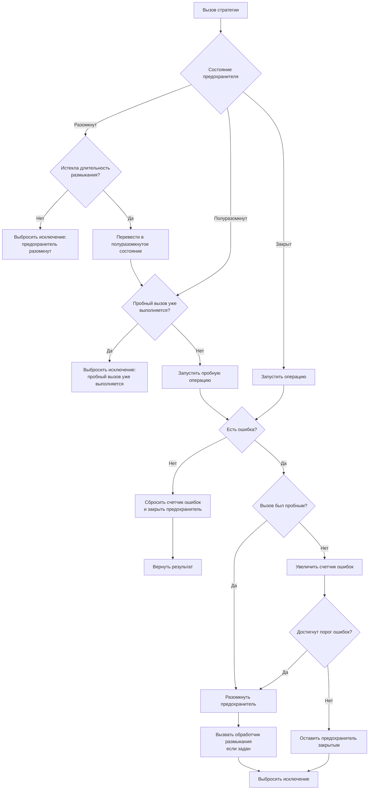

# СтратегияПредохранителя

**Английское название:** `Circuit Breaker`.

## Синтаксис:

```bsl
Новый СтратегияПредохранителя(<ПорогОшибок>, <ДлительностьРазмыкания>)
```

**Параметры:**

| Имя | Тип | Значение по умолчанию | Описание |
| -- | -- | -- | -- |
| ПорогОшибок | Число | `5` | Количество ошибок подряд до размыкания |
| ДлительностьРазмыкания | Число | `30000` | Длительность размыкания в миллисекундах |


## Методы

[Применить](#применить) </br>
[Состояние](#состояние) </br>
[ПорогОшибок](#порогошибок) </br>
[ДлительностьРазмыкания](#длительностьразмыкания) </br>
[КоличествоОшибокПодряд](#количествоошибокподряд) </br>
[УстановитьПорогОшибок](#установитьпорогошибок) </br>
[УстановитьДлительностьРазмыкания](#установитьдлительностьразмыкания) </br>
[УстановитьОбработчикРазмыкания](#установитьобработчикразмыкания) </br>
[Сбросить](#сбросить)


## Применить

**Синтаксис:**

```bsl
Применить(<Операция>, <Параметры>, <СигналПрерыванияОперации>)
```

**Параметры:**

| Имя | Тип | Значение по умолчанию | Описание |
| -- | -- | -- | -- |
| Операция | Действие, ШагПайплайнаОтказоустойчивости, Строка |  | Выполняемая операция, вложенный шаг пайплайна или лямбда-выражение операции |
| Параметры | Массив, ФиксированныйМассив, Произвольный, Неопределено | `Неопределено` | Параметры операции |
| СигналПрерыванияОперации | СигналПрерыванияОперации, Неопределено | `Неопределено` | Сигнал кооперативного прерывания операции |

**Возвращаемое значение:**

Тип: Произвольный.

**Описание:**

Выполняет операцию с учетом состояния предохранителя. 

Если прерывание уже запрошено до запуска пользовательской операции, предохранитель выбрасывает исключение прерывания и не учитывает это как ошибку. Если же прерывание запрошено во время выполнения операции, например внутренней стратегией таймаута, завершение учитывается как ошибка операции и влияет на состояние предохранителя.

В полуразомкнутом состоянии предохранитель разрешает только один пробный вызов. Остальные вызовы в этот момент отклоняются до завершения пробной операции.

**Диаграмма выполнения:**




## Состояние

**Синтаксис:**

```bsl
Состояние()
```

**Возвращаемое значение:**

Тип: Строка.

**Описание:**

Возвращает текущее состояние предохранителя. Возможные значения описаны в [СостоянияПредохранителя](СостоянияПредохранителя.md).


## ПорогОшибок

**Синтаксис:**

```bsl
ПорогОшибок()
```

**Возвращаемое значение:**

Тип: Число.

**Описание:**

Возвращает порог ошибок подряд до размыкания.


## ДлительностьРазмыкания

**Синтаксис:**

```bsl
ДлительностьРазмыкания()
```

**Возвращаемое значение:**

Тип: Число.

**Описание:**

Возвращает длительность размыкания в миллисекундах.


## КоличествоОшибокПодряд

**Синтаксис:**

```bsl
КоличествоОшибокПодряд()
```

**Возвращаемое значение:**

Тип: Число.

**Описание:**

Возвращает текущее количество ошибок подряд.


## УстановитьПорогОшибок

**Синтаксис:**

```bsl
УстановитьПорогОшибок(<ПорогОшибок>)
```

**Параметры:**

| Имя | Тип | Описание |
| -- | -- | -- |
| ПорогОшибок | Число | Количество ошибок подряд до размыкания |

**Возвращаемое значение:**

Тип: СтратегияПредохранителя.

**Описание:**

Устанавливает порог ошибок подряд до размыкания.


## УстановитьДлительностьРазмыкания

**Синтаксис:**

```bsl
УстановитьДлительностьРазмыкания(<ДлительностьРазмыкания>)
```

**Параметры:**

| Имя | Тип | Описание |
| -- | -- | -- |
| ДлительностьРазмыкания | Число | Длительность размыкания в миллисекундах |

**Возвращаемое значение:**

Тип: СтратегияПредохранителя.

**Описание:**

Устанавливает длительность размыкания.


## УстановитьОбработчикРазмыкания

**Синтаксис:**

```bsl
УстановитьОбработчикРазмыкания(<Обработчик>, <ДополнительныеПараметры>)
```

**Параметры:**

| Имя | Тип | Описание |
| -- | -- | -- |
| Обработчик | Действие, Строка | Обработчик, вызываемый при размыкании. Строка трактуется как лямбда-выражение. Получает [КонтекстРазмыканияПредохранителя](КонтекстРазмыканияПредохранителя.md). Возвращаемое значение не используется |
| ДополнительныеПараметры | Массив, ФиксированныйМассив, Произвольный, Неопределено | Дополнительные параметры, которые будут переданы обработчику после контекста размыкания |

**Возвращаемое значение:**

Тип: СтратегияПредохранителя.

**Описание:**

Устанавливает пользовательский обработчик размыкания предохранителя. Если заданы дополнительные параметры, они передаются после контекста размыкания. Подробности о лямбда-выражениях см. в [руководстве](ЛямбдаВыражения.md).


## Сбросить

**Синтаксис:**

```bsl
Сбросить()
```

**Возвращаемое значение:**

Тип: СтратегияПредохранителя.

**Описание:**

Принудительно возвращает предохранитель в закрытое состояние.
