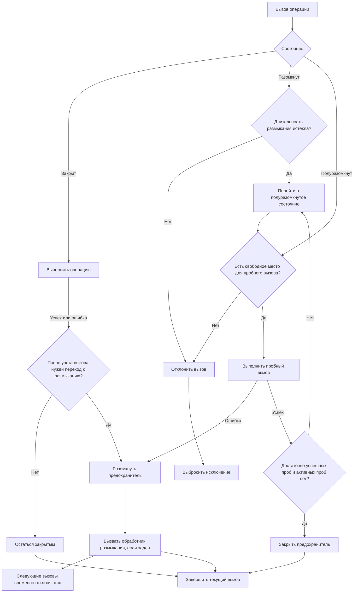

# СтратегияПредохранителя

**Английское название:** `Circuit Breaker`.

## Синтаксис:

```bsl
Новый СтратегияПредохранителя(<ПорогОшибок>, <ДлительностьРазмыкания>)
```

**Параметры:**

| Имя | Тип | Значение по умолчанию | Описание |
| -- | -- | -- | -- |
| ПорогОшибок | Число | `5` | Количество ошибок подряд до размыкания |
| ДлительностьРазмыкания | Число | `30000` | Длительность размыкания в миллисекундах |


## Назначение

Предохранитель защищает систему от повторных обращений к ресурсу, который уже начал отвечать ошибками. После заданного числа ошибок стратегия временно перестает запускать операцию и сразу выбрасывает исключение разомкнутого предохранителя.

Используйте предохранитель для вызовов внешних сервисов, интеграций, баз данных и других операций, где повторные попытки подряд могут только усилить нагрузку.

Готовые сценарии есть в [каталоге примеров](../samples/README.md).


## Как работает

У предохранителя есть три состояния:

| Состояние | Что происходит |
| -- | -- |
| `Закрыт` | Операции выполняются. Успешный вызов очищает серию ошибок подряд, а успех и ошибка обновляют оконную оценку; после оценки возможен переход к размыканию |
| `Разомкнут` | Операции не запускаются. Стратегия сразу выбрасывает исключение, пока не пройдет `ДлительностьРазмыкания` |
| `Полуразомкнут` | Стратегия пропускает ограниченное число пробных вызовов, чтобы проверить, восстановился ли ресурс |

После достижения порога успешных пробных вызовов и завершения всех активных допущенных проб предохранитель закрывается и снова пропускает обычные операции. Ошибка пробного вызова снова размыкает предохранитель.

**Общая диаграмма состояний:**


```mermaid
flowchart TD
    A[Вызов операции] --> B{Состояние}

    B -- Закрыт --> C[Выполнить операцию]
    C -- Успех или ошибка --> E{После учета вызова нужен переход к размыканию?}
    E -- Нет --> D[Остаться закрытым]
    E -- Да --> F[Разомкнуть предохранитель]

    B -- Разомкнут --> G{Длительность размыкания истекла?}
    G -- Нет --> H[Отклонить вызов]
    G -- Да --> I[Перейти в полуразомкнутое состояние]

    B -- Полуразомкнут --> J{Есть свободное место для пробного вызова?}
    I --> J
    J -- Нет --> H
    J -- Да --> K[Выполнить пробный вызов]

    K -- Ошибка --> F
    K -- Успех --> L{Достаточно успешных проб и активных проб нет?}
    L -- Нет --> I
    L -- Да --> P[Закрыть предохранитель]

    F --> R[Вызвать обработчик размыкания, если задан]
    R --> M[Следующие вызовы временно отклоняются]
    R --> N[Завершить текущий вызов]
    D --> N
    P --> N
    H --> O[Выбросить исключение]
```


## Настройка размыкания

По умолчанию стратегия размыкается по количеству ошибок подряд. Порог задается параметром `ПорогОшибок` или методом [УстановитьПорогОшибок](#установитьпорогошибок).

Этот режим удобен, когда важна непрерывная серия сбоев: например, внешний сервис полностью недоступен и несколько вызовов подряд завершаются ошибкой.

Если нужно учитывать не только ошибки подряд, но и долю ошибок среди последних вызовов, включите оконную оценку:

| Настройка | Зачем нужна |
| -- | -- |
| `РазмерОкнаОценки` | Сколько последних завершенных вызовов учитывать. `0` отключает оконную оценку |
| `МинимумВызововДляОценки` | Сколько вызовов должно накопиться перед первой оценкой процента |
| `ПорогПроцентаОшибок` | При каком проценте ошибок предохранитель разомкнется |

Оконная оценка смотрит только на завершенные вызовы в закрытом состоянии: в окно попадают и успешные, и ошибочные вызовы. Пока вызовов меньше `МинимумВызововДляОценки`, окно не размыкает предохранитель.

После каждого учета, включая успешный вызов, стратегия может разомкнуться по `ПричиныРазмыканияПредохранителя.ПроцентОшибок`, если процент ошибок в окне достиг порога.

Оконная оценка дополняет порог ошибок подряд, а не заменяет его. Если включена оконная оценка, предохранитель размыкается по условию `ПорогОшибок` или по условию `ПорогПроцентаОшибок`. Если оба условия срабатывают на одном вызове, причиной размыкания считается `ПричиныРазмыканияПредохранителя.ПоследовательныеОшибки`.

Этот режим удобен, когда сервис отвечает нестабильно: часть вызовов проходит успешно, но доля ошибок уже слишком высокая.


## Пробные вызовы

Когда истекает `ДлительностьРазмыкания`, предохранитель переходит в полуразомкнутое состояние и начинает пропускать пробные вызовы.

| Настройка | Зачем нужна |
| -- | -- |
| `ЛимитПробныхВызовов` | Сколько пробных вызовов может выполняться одновременно. Если все места заняты, следующий вызов отклоняется без запуска операции |
| `ПорогУспешныхПробныхВызововДляЗакрытия` | Сколько успешных пробных вызовов в текущем полуразомкнутом состоянии нужно, чтобы закрыть предохранитель |

Значения по умолчанию: один пробный вызов и один успешный пробный вызов для закрытия.

Эти настройки отвечают за разные вещи: `ЛимитПробныхВызовов` ограничивает параллелизм проб, а `ПорогУспешныхПробныхВызововДляЗакрытия` задает порог восстановления. Значение `ПорогУспешныхПробныхВызововДляЗакрытия` может быть больше лимита: тогда успешные пробы будут накапливаться последовательно или небольшими группами.

`ПорогУспешныхПробныхВызововДляЗакрытия` задает порог успехов, но закрытие происходит, когда порог достигнут и все активные допущенные пробные вызовы текущего полуразомкнутого состояния завершены. Ошибка любой допущенной пробы до закрытия снова размыкает предохранитель. Накопленные успешные пробы при этом сбрасываются.


## Обработчик размыкания

Через [УстановитьОбработчикРазмыкания](#установитьобработчикразмыкания) можно подписаться на момент размыкания. Обработчик получает [КонтекстРазмыканияПредохранителя](КонтекстРазмыканияПредохранителя.md): в нем есть пороги, текущее состояние, метрики окна оценки и причина размыкания.

Возможные причины размыкания описаны в [ПричиныРазмыканияПредохранителя](ПричиныРазмыканияПредохранителя.md):

| Причина | Когда возникает |
| -- | -- |
| `ПричиныРазмыканияПредохранителя.ПоследовательныеОшибки` | Достигнут порог ошибок подряд |
| `ПричиныРазмыканияПредохранителя.ПроцентОшибок` | Достигнут порог процента ошибок в окне оценки |
| `ПричиныРазмыканияПредохранителя.ПробныйВызов` | Пробный вызов завершился ошибкой |


## Методы

[Применить](#применить) </br>
[Состояние](#состояние) </br>
[ПорогОшибок](#порогошибок) </br>
[ДлительностьРазмыкания](#длительностьразмыкания) </br>
[КоличествоОшибокПодряд](#количествоошибокподряд) </br>
[РазмерОкнаОценки](#размерокнаоценки) </br>
[МинимумВызововДляОценки](#минимумвызововдляоценки) </br>
[ПорогПроцентаОшибок](#порогпроцентаошибок) </br>
[ЛимитПробныхВызовов](#лимитпробныхвызовов) </br>
[ПорогУспешныхПробныхВызововДляЗакрытия](#порогуспешныхпробныхвызововдлязакрытия) </br>
[УстановитьПорогОшибок](#установитьпорогошибок) </br>
[УстановитьДлительностьРазмыкания](#установитьдлительностьразмыкания) </br>
[УстановитьРазмерОкнаОценки](#установитьразмерокнаоценки) </br>
[УстановитьМинимумВызововДляОценки](#установитьминимумвызововдляоценки) </br>
[УстановитьПорогПроцентаОшибок](#установитьпорогпроцентаошибок) </br>
[УстановитьЛимитПробныхВызовов](#установитьлимитпробныхвызовов) </br>
[УстановитьПорогУспешныхПробныхВызововДляЗакрытия](#установитьпорогуспешныхпробныхвызововдлязакрытия) </br>
[УстановитьОбработчикРазмыкания](#установитьобработчикразмыкания) </br>
[Сбросить](#сбросить)


## Применить

**Синтаксис:**

```bsl
Применить(<Операция>, <Параметры>, <СигналПрерыванияОперации>)
```

**Параметры:**

| Имя | Тип | Значение по умолчанию | Описание |
| -- | -- | -- | -- |
| Операция | Действие, ШагПайплайнаОтказоустойчивости, Строка |  | Выполняемая операция, вложенный шаг пайплайна или лямбда-выражение операции |
| Параметры | Массив, ФиксированныйМассив, Произвольный, Неопределено | `Неопределено` | Параметры операции |
| СигналПрерыванияОперации | СигналПрерыванияОперации, Неопределено | `Неопределено` | Сигнал кооперативного прерывания операции |

**Возвращаемое значение:**

Тип: Произвольный.

**Описание:**

Выполняет операцию, если предохранитель закрыт или разрешает пробный вызов.

Если предохранитель разомкнут и время ожидания еще не истекло, операция не запускается. Метод сразу выбрасывает исключение разомкнутого предохранителя.

Если передан `СигналПрерыванияОперации` и прерывание уже запрошено до запуска операции, метод выбрасывает исключение прерывания и не учитывает это как ошибку операции. Если операция сама завершилась ошибкой после запуска, эта ошибка влияет на состояние предохранителя.


## Состояние

**Синтаксис:**

```bsl
Состояние()
```

**Возвращаемое значение:**

Тип: Строка.

**Описание:**

Возвращает текущее состояние предохранителя. Возможные значения описаны в [СостоянияПредохранителя](СостоянияПредохранителя.md).


## ПорогОшибок

**Синтаксис:**

```bsl
ПорогОшибок()
```

**Возвращаемое значение:**

Тип: Число.

**Описание:**

Возвращает порог ошибок подряд до размыкания.


## ДлительностьРазмыкания

**Синтаксис:**

```bsl
ДлительностьРазмыкания()
```

**Возвращаемое значение:**

Тип: Число.

**Описание:**

Возвращает длительность размыкания в миллисекундах.


## КоличествоОшибокПодряд

**Синтаксис:**

```bsl
КоличествоОшибокПодряд()
```

**Возвращаемое значение:**

Тип: Число.

**Описание:**

Возвращает текущее количество ошибок подряд.


## РазмерОкнаОценки

**Синтаксис:**

```bsl
РазмерОкнаОценки()
```

**Возвращаемое значение:**

Тип: Число.

**Описание:**

Возвращает размер окна оценки завершенных вызовов. Значение `0` означает, что оконная оценка отключена.


## МинимумВызововДляОценки

**Синтаксис:**

```bsl
МинимумВызововДляОценки()
```

**Возвращаемое значение:**

Тип: Число.

**Описание:**

Возвращает минимальное количество вызовов в окне перед оценкой процента ошибок.


## ПорогПроцентаОшибок

**Синтаксис:**

```bsl
ПорогПроцентаОшибок()
```

**Возвращаемое значение:**

Тип: Число.

**Описание:**

Возвращает процент ошибок, при котором оконная оценка размыкает предохранитель.


## ЛимитПробныхВызовов

**Синтаксис:**

```bsl
ЛимитПробныхВызовов()
```

**Возвращаемое значение:**

Тип: Число.

**Описание:**

Возвращает лимит одновременно выполняющихся пробных вызовов в полуразомкнутом состоянии.


## ПорогУспешныхПробныхВызововДляЗакрытия

**Синтаксис:**

```bsl
ПорогУспешныхПробныхВызововДляЗакрытия()
```

**Возвращаемое значение:**

Тип: Число.

**Описание:**

Возвращает порог успешных пробных вызовов для закрытия. Предохранитель закрывается после достижения порога и завершения всех активных допущенных пробных вызовов текущего полуразомкнутого состояния.


## УстановитьПорогОшибок

**Синтаксис:**

```bsl
УстановитьПорогОшибок(<ПорогОшибок>)
```

**Параметры:**

| Имя | Тип | Описание |
| -- | -- | -- |
| ПорогОшибок | Число | Количество ошибок подряд до размыкания |

**Возвращаемое значение:**

Тип: СтратегияПредохранителя.

**Описание:**

Устанавливает порог ошибок подряд до размыкания.


## УстановитьДлительностьРазмыкания

**Синтаксис:**

```bsl
УстановитьДлительностьРазмыкания(<ДлительностьРазмыкания>)
```

**Параметры:**

| Имя | Тип | Описание |
| -- | -- | -- |
| ДлительностьРазмыкания | Число | Длительность размыкания в миллисекундах |

**Возвращаемое значение:**

Тип: СтратегияПредохранителя.

**Описание:**

Устанавливает длительность размыкания.


## УстановитьРазмерОкнаОценки

**Синтаксис:**

```bsl
УстановитьРазмерОкнаОценки(<РазмерОкнаОценки>)
```

**Параметры:**

| Имя | Тип | Описание |
| -- | -- | -- |
| РазмерОкнаОценки | Число | Количество последних завершенных вызовов для оценки. `0` отключает оконный режим |

**Возвращаемое значение:**

Тип: СтратегияПредохранителя.

**Описание:**

Включает оконную оценку процента ошибок при значении больше `0`. Предохранитель будет учитывать указанное количество последних завершенных вызовов в закрытом состоянии.

Значение `0` отключает оконную оценку. Значение по умолчанию: `0`.

Если оконная оценка включена, `МинимумВызововДляОценки` не может быть больше `РазмерОкнаОценки`.


## УстановитьМинимумВызововДляОценки

**Синтаксис:**

```bsl
УстановитьМинимумВызововДляОценки(<МинимумВызововДляОценки>)
```

**Параметры:**

| Имя | Тип | Описание |
| -- | -- | -- |
| МинимумВызововДляОценки | Число | Минимальное количество завершенных вызовов в окне перед оценкой процентов |

**Возвращаемое значение:**

Тип: СтратегияПредохранителя.

**Описание:**

Задает минимальное количество вызовов, после которого предохранитель начинает оценивать процент ошибок в окне.

Значение по умолчанию: `0`.

Если оконная оценка включена, `МинимумВызововДляОценки` не может быть больше `РазмерОкнаОценки`.


## УстановитьПорогПроцентаОшибок

**Синтаксис:**

```bsl
УстановитьПорогПроцентаОшибок(<ПорогПроцентаОшибок>)
```

**Параметры:**

| Имя | Тип | Описание |
| -- | -- | -- |
| ПорогПроцентаОшибок | Число | Процент ошибок от `1` до `100` включительно |

**Возвращаемое значение:**

Тип: СтратегияПредохранителя.

**Описание:**

Задает процент ошибок, при котором оконная оценка размыкает предохранитель.

Метод имеет смысл вместе с [УстановитьРазмерОкнаОценки](#установитьразмерокнаоценки). Значение по умолчанию: `100`.


## УстановитьЛимитПробныхВызовов

**Синтаксис:**

```bsl
УстановитьЛимитПробныхВызовов(<ЛимитПробныхВызовов>)
```

**Параметры:**

| Имя | Тип | Описание |
| -- | -- | -- |
| ЛимитПробныхВызовов | Число | Максимальное количество одновременно активных пробных вызовов в полуразомкнутом состоянии |

**Возвращаемое значение:**

Тип: СтратегияПредохранителя.

**Описание:**

Задает, сколько пробных вызовов может выполняться одновременно в полуразомкнутом состоянии.

Это не общее количество пробных попыток. Если лимит уже занят, новый вызов отклоняется без запуска операции и не считается ни успешной, ни ошибочной пробой.

Значение по умолчанию: `1`.


## УстановитьПорогУспешныхПробныхВызововДляЗакрытия

**Синтаксис:**

```bsl
УстановитьПорогУспешныхПробныхВызововДляЗакрытия(<ПорогУспешныхПробныхВызововДляЗакрытия>)
```

**Параметры:**

| Имя | Тип | Описание |
| -- | -- | -- |
| ПорогУспешныхПробныхВызововДляЗакрытия | Число | Количество успешных пробных вызовов, после которого предохранитель закрывается |

**Возвращаемое значение:**

Тип: СтратегияПредохранителя.

**Описание:**

Задает порог успешных пробных вызовов, после которого предохранитель сможет снова перейти в закрытое состояние.

Успехи считаются в текущем полуразомкнутом состоянии. Закрытие происходит, когда порог достигнут и все активные допущенные пробные вызовы текущего полуразомкнутого состояния завершены. Если любой допущенный пробный вызов завершается ошибкой до закрытия, предохранитель снова размыкается и накопленные успехи сбрасываются.

Значение по умолчанию: `1`.


## УстановитьОбработчикРазмыкания

**Синтаксис:**

```bsl
УстановитьОбработчикРазмыкания(<Обработчик>, <ДополнительныеПараметры>)
```

**Параметры:**

| Имя | Тип | Описание |
| -- | -- | -- |
| Обработчик | Действие, Строка | Обработчик, вызываемый при размыкании. Строка трактуется как лямбда-выражение. Получает [КонтекстРазмыканияПредохранителя](КонтекстРазмыканияПредохранителя.md). Возвращаемое значение не используется |
| ДополнительныеПараметры | Массив, ФиксированныйМассив, Произвольный, Неопределено | Дополнительные параметры, которые будут переданы обработчику после контекста размыкания |

**Возвращаемое значение:**

Тип: СтратегияПредохранителя.

**Описание:**

Устанавливает пользовательский обработчик размыкания предохранителя. Если заданы дополнительные параметры, они передаются после контекста размыкания. Подробности о лямбда-выражениях см. в [руководстве](ЛямбдаВыражения.md).


## Сбросить

**Синтаксис:**

```bsl
Сбросить()
```

**Возвращаемое значение:**

Тип: СтратегияПредохранителя.

**Описание:**

Принудительно возвращает предохранитель в закрытое состояние и сбрасывает накопленное состояние стратегии.
