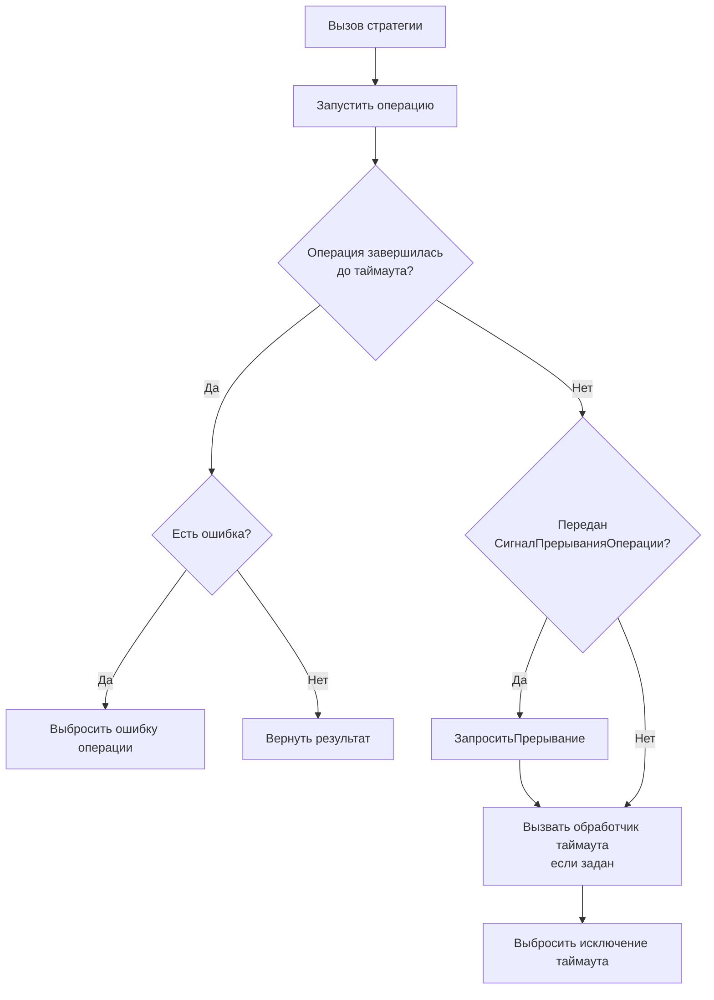

# СтратегияТаймаута

**Английское название:** `Timeout`.

## Синтаксис:

```bsl
Новый СтратегияТаймаута(<Таймаут>)
```

**Параметры:**

| Имя | Тип | Описание |
| -- | -- | -- |
| Таймаут | Число | Максимально допустимое время ожидания в миллисекундах |


## Методы

[Применить](#применить) </br>
[Таймаут](#таймаут) </br>
[УстановитьТаймаут](#установитьтаймаут) </br>
[УстановитьОбработчикТаймаута](#установитьобработчиктаймаута)


## Применить

**Синтаксис:**

```bsl
Применить(<Операция>, <Параметры>, <СигналПрерыванияОперации>)
```

**Параметры:**

| Имя | Тип | Значение по умолчанию | Описание |
| -- | -- | -- | -- |
| Операция | Действие, ШагПайплайнаОтказоустойчивости, Строка |  | Выполняемая операция, вложенный шаг пайплайна или лямбда-выражение операции |
| Параметры | Массив, ФиксированныйМассив, Произвольный, Неопределено | `Неопределено` | Параметры операции |
| СигналПрерыванияОперации | СигналПрерыванияОперации, Неопределено | `Неопределено` | Сигнал кооперативного прерывания операции |

**Возвращаемое значение:**

Тип: Произвольный.

**Описание:**

Запускает операцию и ожидает ее завершения не дольше заданного таймаута. Перед выбросом исключения по таймауту может вызвать пользовательский обработчик.

**Диаграмма выполнения:**



> [!NOTE]
> `СтратегияТаймаута` ограничивает время ожидания результата вызывающим кодом, но не завершает пользовательский код принудительно.
>
> При таймауте стратегия запрашивает переданный `СигналПрерыванияОперации`, чтобы пользовательская операция могла завершиться кооперативно. Ожидание самой стратегии внешним сигналом не прерывается: она ждет результат через `ОжидатьЗавершения(Таймаут)`.

## Кооперативное прерывание

Чтобы операция могла завершиться после таймаута, передайте один и тот же `СигналПрерыванияОперации` в `Применить(...)`, `Пайплайн.Запустить(...)` или `Пайплайн.ЗапуститьАсинх(...)`.

После истечения таймаута стратегия запрашивает этот сигнал. Дальше завершение зависит от пользовательского кода: длительные циклы, ожидания и вложенные вызовы должны периодически вызывать `ПроверитьПрерывание()` или проверять `ПрерываниеЗапрошено()`. Если операция не проверяет сигнал, она продолжит выполняться в фоне до естественного завершения.

## Таймаут

**Синтаксис:**

```bsl
Таймаут()
```

**Возвращаемое значение:**

Тип: Число.

**Описание:**

Возвращает установленный таймаут в миллисекундах.


## УстановитьТаймаут

**Синтаксис:**

```bsl
УстановитьТаймаут(<Таймаут>)
```

**Параметры:**

| Имя | Тип | Описание |
| -- | -- | -- |
| Таймаут | Число | Максимально допустимое время ожидания в миллисекундах |

**Возвращаемое значение:**

Тип: СтратегияТаймаута.

**Описание:**

Устанавливает таймаут ожидания операции.


## УстановитьОбработчикТаймаута

**Синтаксис:**

```bsl
УстановитьОбработчикТаймаута(<Обработчик>, <ДополнительныеПараметры>)
```

**Параметры:**

| Имя | Тип | Значение по умолчанию | Описание |
| -- | -- | -- | -- |
| Обработчик | Действие, Строка |  | Обработчик, который вызывается при превышении таймаута. Строка трактуется как лямбда-выражение. Получает [КонтекстТаймаута](КонтекстТаймаута.md). Возвращаемое значение не используется |
| ДополнительныеПараметры | Массив, ФиксированныйМассив, Произвольный, Неопределено | `Неопределено` | Дополнительные параметры обработчика |

**Возвращаемое значение:**

Тип: СтратегияТаймаута.

**Описание:**

Устанавливает обработчик, который вызывается перед исключением при превышении таймаута. Если заданы дополнительные параметры, они передаются после контекста таймаута. Подробности о лямбда-выражениях см. в [руководстве](ЛямбдаВыражения.md).
